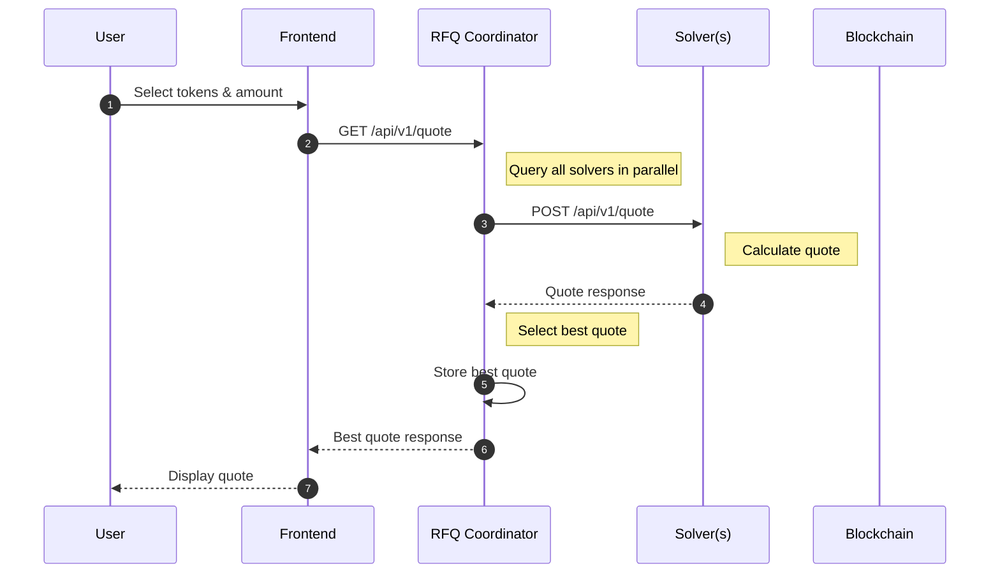
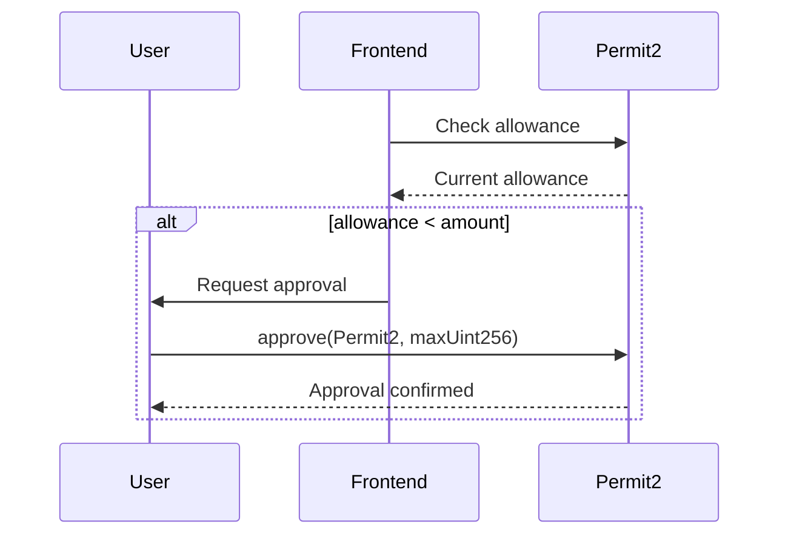
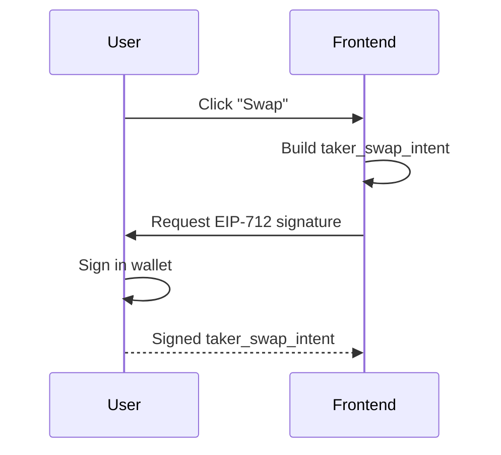
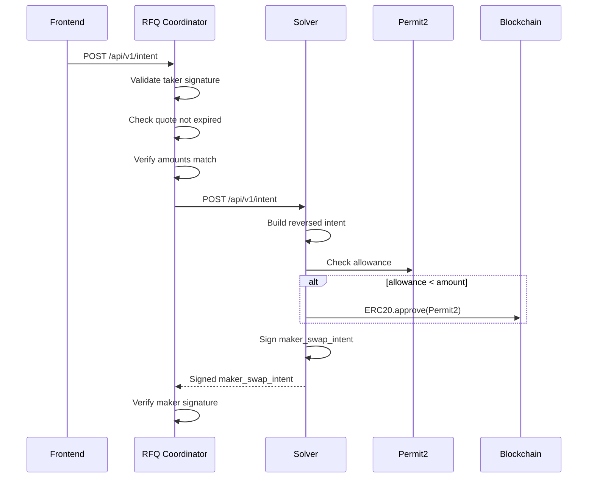
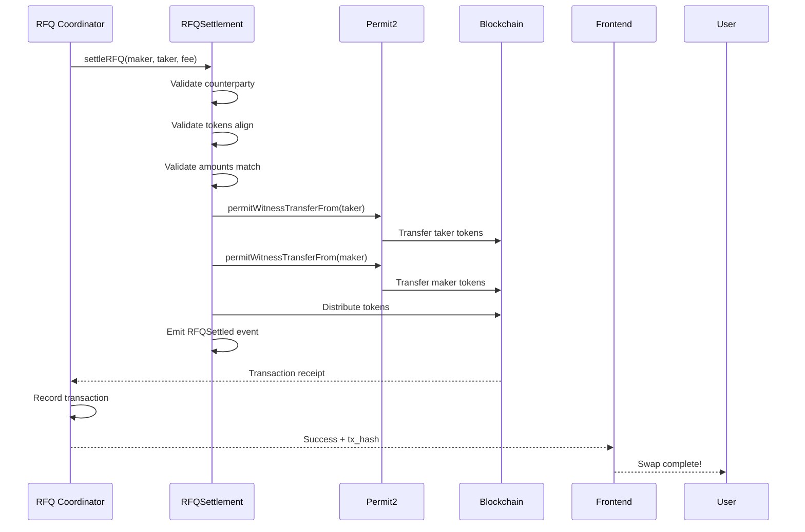

This page provides a comprehensive view of all interactions in the RFQ Protocol, broken down by phase for clarity.

## Actors

| Actor | Description |
|-------|-------------|
| User | End user with wallet (MetaMask, etc.) |
| Frontend | DApp UI |
| RFQ Coordinator | Off-chain coordinator that aggregates quotes |
| Solver(s) | Solver services |
| Permit2 | Uniswap Permit2 contract |
| RFQSettlement | Settlement contract |
| Blockchain | EVM chain |

---

## Phase 1: Quote Request

The user requests a price quote, which is fetched from all registered solvers in parallel.



<Steps>
  <Step title="User Selection">
    User selects input token, output token, and amount in the UI
  </Step>
  <Step title="Quote Request">
    Frontend sends `GET /api/v1/quote` with token addresses and amount
  </Step>
  <Step title="Parallel Queries">
    RFQ Coordinator queries ALL registered solvers in parallel (5s timeout)
  </Step>
  <Step title="Price Calculation">
    Each solver calculates a quote based on their own pricing logic and returns it with expiry
  </Step>
  <Step title="Best Quote Selection">
    Coordinator compares all quotes and returns the one with highest `amount_out`
  </Step>
</Steps>

---

## Phase 2: Approval (One-Time)

If the user hasn't approved Permit2 for this token, they need to do so once.



<Note>
  This phase only happens **once per token**. After approval, users can swap without additional on-chain transactions.
</Note>

---

## Phase 3: Sign Intent

The user signs their swap intent using EIP-712 typed data signing.



<Steps>
  <Step title="Build Intent">
    Frontend constructs the `taker_swap_intent` with input/output tokens, amounts, unwrap flag, and referral
  </Step>
  <Step title="EIP-712 Signature">
    User signs the intent using their wallet's `signTypedData` function
  </Step>
  <Step title="Signature Params">
    The signature includes deadline, nonce (from Permit2), signer address, and signature bytes
  </Step>
</Steps>

---

## Phase 4: Submit Intent

The signed intent is submitted to the coordinator, which forwards it to the solver for counter-signature.



<Steps>
  <Step title="Validation">
    Coordinator validates taker signature, checks quote hasn't expired, and verifies amounts match
  </Step>
  <Step title="Forward to Solver">
    Coordinator sends the signed intent to the winning solver
  </Step>
  <Step title="Intent Reversal">
    Solver builds a REVERSED intent: swaps input/output tokens and amounts, sets counterparty to user
  </Step>
  <Step title="Solver Signature">
    Solver signs their reversed intent and returns it
  </Step>
</Steps>

---

## Phase 5: On-Chain Settlement

The coordinator executes the atomic swap on-chain via the RFQSettlement contract.



<Steps>
  <Step title="Contract Call">
    Coordinator calls `RFQSettlement.settleRFQ()` with both signed intents
  </Step>
  <Step title="Validation">
    Contract validates counterparty matches, tokens align, amounts match, and fee is within limits
  </Step>
  <Step title="Permit2 Transfers">
    Contract calls Permit2 to transfer tokens from both parties
  </Step>
  <Step title="Final Distribution">
    Contract distributes: Fee → Treasury, Output → User, Input → Solver
  </Step>
</Steps>

---

## Timing Constraints

| Phase | Timeout | Notes |
|-------|---------|-------|
| Quote Request | 5 seconds | Coordinator waits max 5s for solver responses |
| Quote TTL | 15-30 seconds | Depends on market volatility (default: 15s min, 30s max) |
| Intent Submit | 10 seconds | Coordinator waits max 10s for solver signature |
| Settlement | ~3 seconds | Depends on block time |

```
Timeline:
├──────────────────────────────────────────────────────────────────┤
│                                                                    │
│  [0s]        [5s]           [20s]          [30s]        [33s]    │
│   │           │               │              │            │       │
│   ├─ Quote ──►├── Quote Valid►├─ Submit ────►├─ Settle ──►│       │
│   │  Request  │   (15s TTL)   │  Intent      │  On-chain  │       │
│                                                                    │
└──────────────────────────────────────────────────────────────────┘
```

---

## Error Scenarios

| Phase | Error | HTTP Status | Cause |
|-------|-------|-------------|-------|
| **Quote Request** | No quotes available | 503 | All solvers timed out |
| | Validation error | 400 | Invalid parameters |
| | Market not found | 404 | Token pair not supported |
| **Sign Intent** | Flow cancelled | - | User rejected signature |
| | Quote expired | 400 | TTL exceeded |
| **Submit Intent** | Invalid signature | 400 | Signature verification failed |
| | Solver timeout | 504 | Solver didn't respond |
| | Solver error | 500 | Solver internal error |
| **Settlement** | InsufficientBalance | Revert | User lacks tokens |
| | InvalidNonce | Revert | Nonce already used |
| | SignatureExpired | Revert | Deadline passed |

See [Error Handling](/concepts/error-codes) for complete error documentation.
