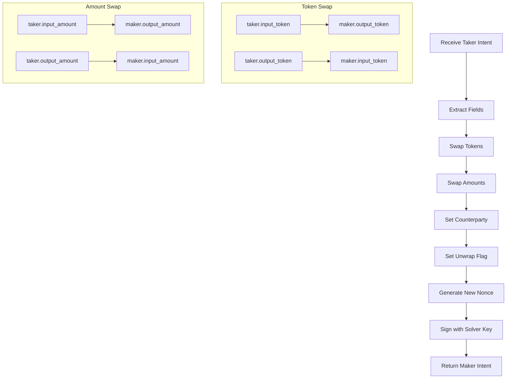

When a user (taker) submits their signed swap intent, the solver (maker) must create a **reversed** intent that mirrors the trade from their perspective.

## Why Reversal?

In an atomic swap, both parties are simultaneously:
- **Giving** one token
- **Receiving** another token

The taker's intent describes what they want to give and receive. The solver's intent must describe the **opposite** - what the solver gives and receives.

## Visual Explanation

<CardGroup cols={2}>
  <Card title="Taker (User)" icon="user">
    **Gives:** 1000 USDC

    **Receives:** 0.5 WETH
  </Card>
  <Card title="Maker (Solver)" icon="server">
    **Gives:** 0.5 WETH

    **Receives:** 1000 USDC
  </Card>
</CardGroup>

The tokens and amounts are **mirrored** between the two parties:
- What the taker **gives** = what the maker **receives**
- What the taker **receives** = what the maker **gives**

## Intent Comparison

| Field | Taker Intent | Maker Intent | Transformation |
|-------|--------------|--------------|----------------|
| `input_token` | USDC | WETH | Swapped |
| `output_token` | WETH | USDC | Swapped |
| `input_amount` | 1000 | 0.5 | Swapped |
| `output_amount` | 0.5 | 1000 | Swapped |
| `counterparty` | (none) | Taker address | Added |
| `unwrap` | false | false | Solver's choice (independent) |

## Detailed Example

### Taker Intent (User)

```json
{
  "swap_intent": {
    "input_token": "0x3894085ef7ff0f0aedf52e2a2704928d1ec074f1",  // USDC
    "output_token": "0xe30fedd158a2e3b13e9badaeabafc5516e95e8c7", // WETH
    "input_amount": "1000000000",        // 1000 USDC (6 decimals)
    "output_amount": "498500000000000000", // 0.4985 WETH (18 decimals)
    "unwrap": false,
    "frontend_referral": "0x0000...0000"
  },
  "signature_params": {
    "deadline": "1705613400",
    "nonce": "12345",
    "signer": "0xUserAddress...",
    "signature": "0xTakerSignature..."
  }
}
```

### Maker Intent (Solver) - Reversed

```json
{
  "swap_intent": {
    "counterparty": "0xUserAddress...",   // Added: taker's address
    "input_token": "0xe30fedd158a2e3b13e9badaeabafc5516e95e8c7",  // WETH (was output)
    "output_token": "0x3894085ef7ff0f0aedf52e2a2704928d1ec074f1", // USDC (was input)
    "input_amount": "498500000000000000",  // 0.4985 WETH (was output_amount)
    "output_amount": "1000000000",         // 1000 USDC (was input_amount)
    "unwrap": false
  },
  "signature_params": {
    "deadline": "1705613400",    // Same deadline
    "nonce": "67890",            // Different nonce (solver's nonce)
    "signer": "0xSolverAddress...",
    "signature": "0xMakerSignature..."
  }
}
```

## Reversal Logic



## Reversal Rules

The solver creates a maker intent by:

1. **Swap tokens**: `inputToken` ↔ `outputToken`
2. **Swap amounts**: `inputAmount` ↔ `outputAmount`
3. **Set counterparty**: Set to the taker's address (prevents front-running)
4. **Set unwrap**: Solver decides independently whether to receive unwrapped ETH

<Note>
  The solver's `unwrap` flag is independent of the taker's. Each party decides for themselves whether they want to receive unwrapped native tokens.
</Note>

## Settlement Validation

When the contract receives both intents, it validates the reversal:

```
maker.inputToken == taker.outputToken              ✓
maker.outputToken == taker.inputToken              ✓
maker.inputAmount == taker.outputAmount            ✓
maker.outputAmount == taker.inputAmount - fee      ✓
maker.counterparty == taker.signer                 ✓
```

The maker's `outputAmount` must equal the taker's `inputAmount` minus the protocol fee. The fee is calculated as: `fee = taker.inputAmount * feePips / 1,000,000`

This ensures the maker only receives the post-fee amount while the protocol fee is routed to the fee treasury. See [Fee Mechanics](/concepts/fee-mechanics) for details.

<Note>
  The counterparty field is optional. If set to zero address, the maker's intent can be settled with any taker. This is useful for public limit orders.
</Note>

## Why Counterparty Matters

The `counterparty` field prevents front-running:

| Scenario | Without Counterparty | With Counterparty |
|----------|---------------------|-------------------|
| Attacker sees pending tx | Can intercept and settle with their own taker intent | Cannot settle - counterparty doesn't match |
| MEV bots | Can exploit the trade | Protected |
| Intended taker | May lose the trade | Guaranteed to receive |

<Warning>
  Solvers should ALWAYS set the counterparty to the taker's address. Setting it to zero exposes the trade to front-running attacks.
</Warning>
