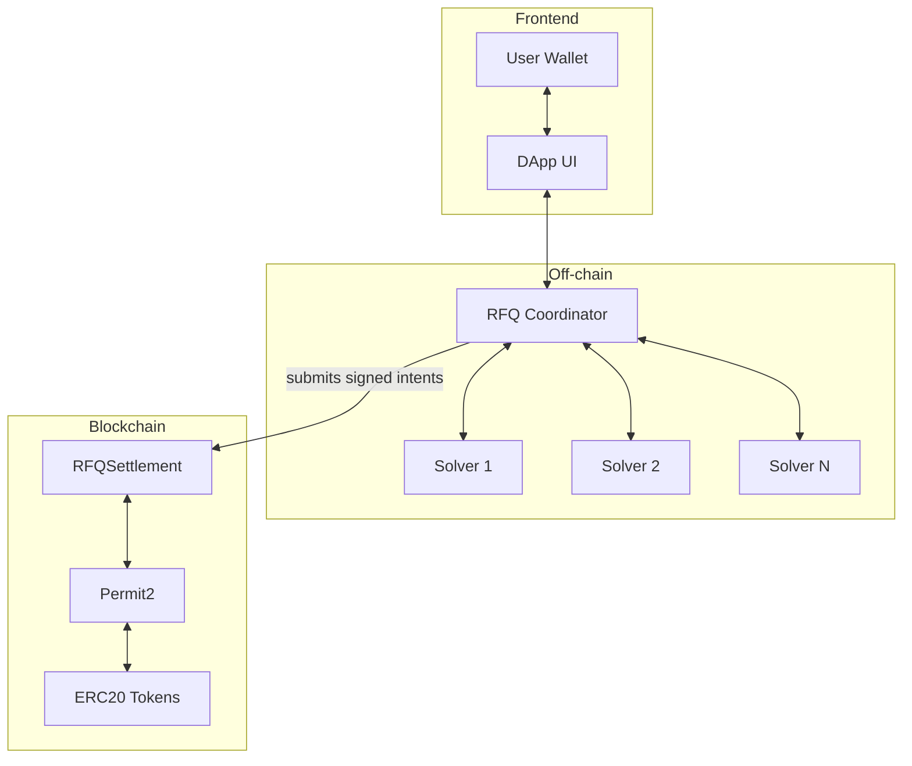

The RFQ Protocol consists of three main components that work together to enable gasless, atomic token swaps.

## Components

<Note>
  The RFQSettlement contract executes permissionlessly—anyone with valid signatures can submit the transaction.
</Note>

## Component Details

### RFQ Coordinator

The RFQ Coordinator is an off-chain service that:

- **Aggregates quotes** from all registered solvers in parallel
- **Selects the best quote** based on output amount
- **Validates request parameters** and quote responses
- **Verifies signatures** before on-chain settlement
- **Coordinates settlement** via the RFQSettlement contract
- **Stores analytics** for executed trades

| Endpoint | Method | Description |
|----------|--------|-------------|
| `/api/v1/config` | GET | Get chain configuration |
| `/api/v1/markets` | GET | Get available trading pairs |
| `/api/v1/quote` | GET | Request best quote |
| `/api/v1/intent` | POST | Submit signed intent |
| `/api/v1/health` | GET | Health check |

### Solver

Each Solver is a service that:

- **Provides liquidity** for specific trading pairs
- **Generates quotes** based on their own pricing logic
- **Guarantees quotes** with sufficient collateral to fulfill trades
- **Signs counter-intents** to complete the swap
- **Manages token approvals** to Permit2

| Endpoint | Method | Description |
|----------|--------|-------------|
| `/api/v1/markets` | POST | Return supported markets |
| `/api/v1/quote` | POST | Generate quote |
| `/api/v1/intent` | POST | Sign counter-intent |
| `/api/v1/health` | GET | Health check |

### RFQSettlement Contract

The on-chain settlement contract that:

- **Validates** that maker and taker intents match
- **Executes** atomic swaps using Permit2
- **Reverts entirely** if either side fails or signatures are invalid
- **Collects fees** (if configured)
- **Emits events** for analytics

### Permit2

Uniswap's Permit2 contract enables:

- **Gasless approvals** via EIP-712 signatures
- **Witness data** for intent verification

## Data Flow

1. **User** selects tokens and amount in the UI
2. **Client** calls RFQ Coordinator for a quote
3. **RFQ Coordinator** queries all solvers in parallel (5s timeout)
4. **Solvers** return quotes with pricing
5. **RFQ Coordinator** returns the best quote (highest output)
6. **User** signs the swap intent using EIP-712
7. **Client** submits the signed intent to RFQ Coordinator
8. **RFQ Coordinator** forwards to the winning solver
9. **Solver** signs the counter-intent with matching terms and reversed amounts
10. **Trade is settled** atomically on-chain via the RFQSettlement contract

## Failure Handling

- **No solver response** → no trade (user is not charged)
- **Quote expiration** → intent rejected (user must request new quote)
- **Settlement failure** → atomic revert (no partial execution)

## Security Considerations

<Warning>
  The RFQ Protocol uses cryptographic signatures for authorization. Never share your private keys or signed messages with untrusted parties.
</Warning>

- **EIP-712 signatures** provide typed data signing with domain separation
- **Permit2 nonces** prevent replay attacks
- **Deadline enforcement** ensures time-limited validity
- **Counterparty validation** ensures only the intended parties can settle

### Coordinator Trust Model

The RFQ Coordinator operates with minimal trust requirements:

- **Cannot move funds** without valid user + solver signatures
- **Cannot change prices or amounts** after signatures are collected
- **Cannot settle expired or mismatched intents** (contract enforces validation)
