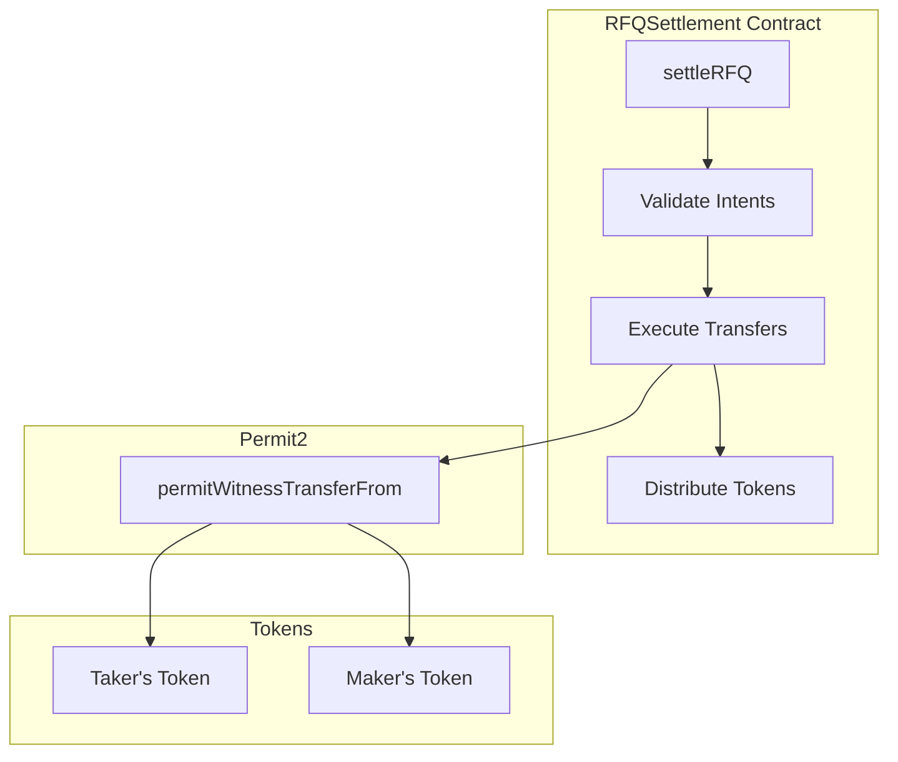
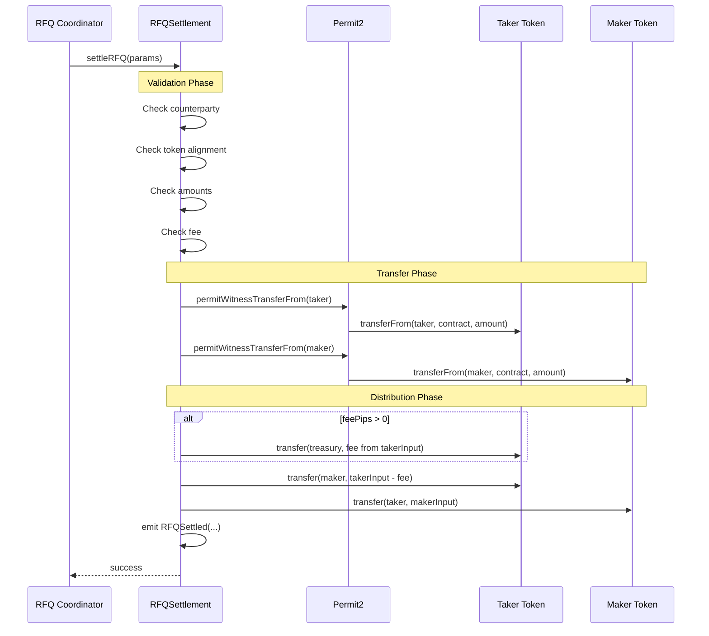

The RFQSettlement contract is responsible for executing atomic token swaps between takers (users) and makers (solvers).

## Contract Overview



## Settlement Function

The `settleRFQ()` function accepts:

```solidity
struct RFQParams {
    MakerSignedSwapIntent makerSignedSwapIntent;
    TakerSignedSwapIntent takerSignedSwapIntent;
    uint256 feePips;  // Fee in parts per million (max 10,000 = 1%)
}
```

### Maker Intent Structure

```solidity
struct MakerSwapIntent {
    address counterparty;   // Taker's address (or zero for any)
    address inputToken;     // Token the maker is selling
    address outputToken;    // Token the maker is buying
    uint256 inputAmount;    // Amount maker is selling
    uint256 outputAmount;   // Amount maker expects to receive
    bool unwrap;            // Whether to unwrap WETH
}
```

### Taker Intent Structure

```solidity
struct TakerSwapIntent {
    address inputToken;     // Token the taker is selling
    address outputToken;    // Token the taker is buying
    uint256 inputAmount;    // Amount taker is selling
    uint256 outputAmount;   // Amount taker expects to receive
    bool unwrap;            // Whether to unwrap WETH
    bytes32 frontendReferral;  // Frontend referral code
}
```

## Validation Rules

The contract performs several validations before executing the swap:

<AccordionGroup>
  <Accordion title="Counterparty Validation">
    ```
    maker.counterparty == taker.signer OR maker.counterparty == address(0)
    ```
    The maker can specify a specific counterparty or set it to zero to allow any taker.
  </Accordion>

  <Accordion title="Token Alignment">
    ```
    maker.inputToken == taker.outputToken
    maker.outputToken == taker.inputToken
    ```
    The tokens must be swapped - what the maker is selling must be what the taker is buying.
  </Accordion>

  <Accordion title="Amount Matching (Fee-Adjusted)">
    ```
    // Fee is deducted from taker's input before matching
    fee = (taker.inputAmount * feePips) / PIPS
    quoteAmount = taker.inputAmount - fee

    // Validation rules:
    maker.inputAmount == taker.outputAmount   // What taker receives
    maker.outputAmount == quoteAmount         // What maker receives (after fee)
    ```
    The maker's `outputAmount` expectation must equal the taker's input MINUS the fee.
    The taker receives the maker's full `inputAmount` with no deduction.
  </Accordion>

  <Accordion title="Fee Validation">
    ```
    feePips > 0 AND feePips <= MAX_FEE_PIPS (10,000 = 1%)
    ```
    The fee must be positive and cannot exceed the maximum allowed (1%).
  </Accordion>
</AccordionGroup>

## Execution Flow



## Fee Calculation

Fees are calculated in parts per million (PIPS) where 1,000,000 = 100%:

```
PIPS = 1,000,000
MAX_FEE_PIPS = 10,000 (1% maximum)

// Fee deducted from taker's input
fee = (taker.inputAmount * feePips) / PIPS
quoteAmount = taker.inputAmount - fee  // What maker receives

// Distribution (all in same token - taker's input token):
treasury receives: fee
maker receives:    taker.inputAmount - fee

// Taker receives maker's full input (different token):
taker receives:    maker.inputAmount (no deduction)
```

**Example:**
- Taker swaps 1000 USDC for WETH
- Fee: 3000 PIPS (0.3%)
- Fee amount: 1000 USDC × 3000 / 1,000,000 = 3 USDC

**Distribution:**
- Treasury receives: 3 USDC
- Maker receives: 997 USDC (taker's input minus fee)
- Taker receives: Full WETH amount from maker (no fee deducted)

<Note>
The fee is always taken from the taker's input token. The maker quotes knowing they will receive `takerInput - fee`, so the taker's expected output is not reduced.
</Note>

## Events

The contract emits an `RFQSettled` event on successful settlement:

```solidity
event RFQSettled(
    bytes32 indexed frontendReferral,
    address feeToken,
    uint256 feeAmount,
    RFQParams rfqParams
);
```

## Revert Reasons

The contract defines the following custom errors:

| Error | Cause | Solution |
|-------|-------|----------|
| `NoValueDonations` | Native ETH sent outside of RFQ settlement | Don't send ETH directly to contract |
| `InvalidAddress` | Zero address passed where non-zero required | Check addresses are valid |
| `RFQInvalidCounterparty` | Maker's counterparty doesn't match taker | Use correct counterparty address |
| `RFQInvalidToken` | Token pair mismatch or same input/output token | Check token addresses align |
| `RFQInvalidAmount` | Amounts don't match or are zero | Verify amount calculations |
| `RFQInvalidFeePips` | Fee is zero or exceeds MAX_FEE_PIPS | Use valid fee (1-10,000) |

## Contract Addresses

Contract addresses can be retrieved from the `/api/v1/config` endpoint:

```bash
curl "https://api-rfq.dragonswap.app/api/v1/config?chain_id=<CHAIN_ID>"
```

<Note>
  The RFQSettlement contract is immutable once deployed. Always verify the contract address via the config endpoint before interacting.
</Note>
