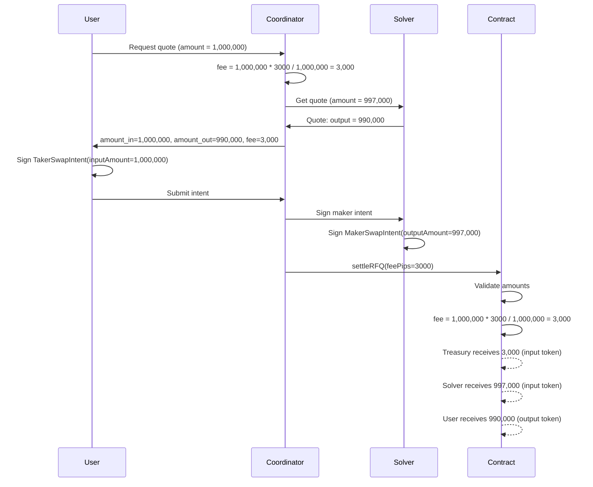

## Overview

The RFQ Protocol charges a per-market protocol fee on every trade. Fees are configured per market in basis points (`fee_tier_bps`) and enforced on-chain by the settlement contract.

## Fee Configuration

Each whitelisted market has a `fee_tier_bps` (fee tier in basis points) field. For example, `fee_tier_bps: 30` means a 0.30% fee.

The on-chain contract uses **pips** (parts per million) for precision:

| Unit | Value | Example |
|------|-------|---------|
| 1 basis point (bps) | 100 pips | 0.01% |
| 30 bps | 3,000 pips | 0.30% |
| Maximum | 10,000 pips | 1.00% |

**Conversion:** `feePips = fee_tier_bps * 100`

The on-chain constant `PIPS = 1,000,000` is the denominator, so `fee = amount * feePips / 1,000,000`.

## Fee Flow

### 1. Quote Phase (Off-chain)

When a user requests a quote:

1. The coordinator calculates the fee: `fee = userAmount * feePips / 1,000,000`
2. The coordinator sends `userAmount - fee` (post-fee amount) to the solver for pricing
3. The solver quotes based on the post-fee amount
4. The user receives a response with:
   - `amount_in` = their original amount (fee-inclusive)
   - `amount_out` = the solver's quote
   - `fee` = the deducted fee amount

### 2. Signing Phase (User)

The user signs a `TakerSwapIntent` with:
- `inputAmount` = `amount_in` (the full fee-inclusive amount)
- `outputAmount` = `amount_out`

### 3. Settlement Phase (On-chain)

The contract calculates and distributes:

```
feeAmount = taker.inputAmount * feePips / PIPS
quoteAmount = taker.inputAmount - feeAmount
```

Distribution:
1. **Fee treasury** receives `feeAmount` of the taker's input token
2. **Maker (solver)** receives `quoteAmount` of the taker's input token (with optional unwrap)
3. **Taker (user)** receives `baseAmount` of the maker's input token (with optional unwrap)

### Validation Rules

The settlement contract enforces:
- `maker.outputAmount == taker.inputAmount - feeAmount` -- the maker's quote must match the post-fee amount
- `maker.inputAmount == taker.outputAmount` -- token amounts must align
- `feePips > 0 && feePips <= MAX_FEE_PIPS (10,000)` -- fee must be within bounds

## Fee Lifecycle Diagram


