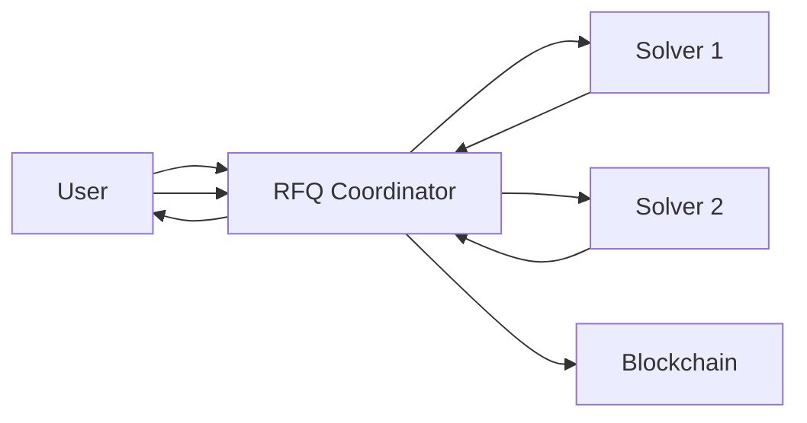

# Welcome to RFQ Protocol

RFQ Protocol enables **gasless, atomic token swaps** by sourcing fixed quotes from professional market makers—delivering better pricing, zero slippage, and MEV protection.

## What is RFQ?

RFQ (Request for Quote) is a trading model where users request fixed prices from professional market makers and execute the trade only after explicitly accepting the quote. It enables better pricing, zero slippage, and MEV protection, especially for large or illiquid trades.

**Flow:**
1. User requests quote from RFQ Coordinator
2. Coordinator queries all registered solvers
3. Solvers return their quotes
4. Coordinator returns the best quote to user
5. User signs and submits intent
6. Coordinator collects solver signature for the intent
7. Trade is settled atomically on-chain via the RFQSettlement contract

## Key Features

<CardGroup cols={2}>
  <Card title="Gasless Approvals" icon="gas-pump">
    Users sign EIP-712 messages instead of on-chain approval transactions using Uniswap's Permit2.
  </Card>
  <Card title="Atomic Swaps" icon="atom">
    Trades settle atomically on-chain—either both parties receive their tokens or neither does.
  </Card>
  <Card title="Best Execution" icon="trophy">
    The coordinator queries all registered solvers in parallel and returns the best quote.
  </Card>
  <Card title="Zero Slippage" icon="shield-check">
    Quotes are firm—you receive exactly what was quoted (minus protocol fees).
  </Card>
  <Card title="MEV Protection" icon="lock">
    Fixed quotes from solvers eliminate front-running and sandwich attacks.
  </Card>
  <Card title="Quote Integrity" icon="signature">
    Quotes are signed and time-bound, preventing replay and price manipulation.
  </Card>
</CardGroup>

## Architecture Overview

The RFQ system consists of three main components:

| Component | Description |
|-----------|-------------|
| **RFQ Coordinator** | Off-chain coordinator that aggregates quotes from solvers |
| **Solver** | Market maker that provides quotes and liquidity |
| **RFQSettlement** | Smart contract that executes atomic swaps on-chain |

<Note>
  **Trust Assumption:** The RFQ Coordinator does not custody user funds and cannot execute trades without valid user and solver signatures.
</Note>

## Supported Networks

RFQ Protocol is EVM-compatible and can be deployed on any EVM chain. See the [configuration endpoint](/frontend/api/get-config) for currently supported networks.

## Quick Links

<CardGroup cols={2}>
  <Card title="Client Quickstart" icon="rocket" href="/frontend/getting-started">
    Get started with your first API call
  </Card>
  <Card title="API Reference" icon="code" href="/frontend/api/get-markets">
    Explore all available endpoints
  </Card>
  <Card title="Client Integration" icon="plug" href="/frontend/integration-guide">
    Learn how to integrate RFQ in your app
  </Card>
  <Card title="Become a Solver" icon="server" href="/solver/getting-started">
    Run your own market maker
  </Card>
</CardGroup>
