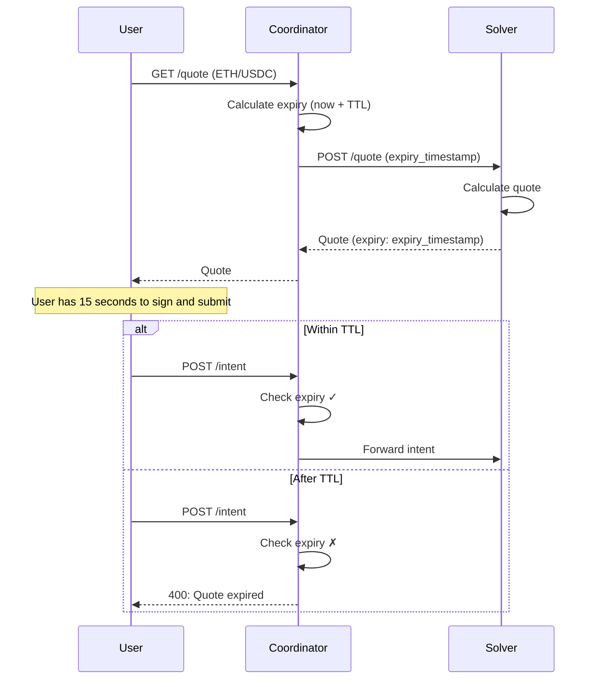

Quote TTL (Time-To-Live) determines how long a quote remains valid before expiring. Different markets have different TTLs based on their price volatility.

## Why Variable TTL?

Price volatility varies significantly between trading pairs:

| Market Type | Price Movement | Risk |
|-------------|----------------|------|
| **Volatile** (ETH/USDC) | Can move 1-5% in minutes | High risk of adverse selection |
| **Stable** (USDC/USDT) | Moves < 0.1% typically | Low risk, prices are stable |

Solvers face **adverse selection risk** - if prices move against them during the quote validity period, they may be forced to execute at unfavorable prices.

## TTL Configuration

| Market Type | Example Pairs | TTL | Reason |
|-------------|---------------|-----|--------|
| **Volatile** | ETH/USDC, SEI/USDC, BTC/USDC | 15 seconds | High price volatility |
| **Stable** | USDC/USDT, DAI/USDC | 30 seconds | Price is relatively stable |

## How It Works



## Quote Request Flow

The coordinator sends `expiry_timestamp` to the solver, telling them exactly when the quote must expire:

```json
{
  "input_token": "0x...",
  "output_token": "0x...",
  "amount": "1000000000",
  "chain_id": "...",
  "expiry_timestamp": 1705612830000
}
```

The solver uses this timestamp directly in the response:

```typescript
const expiry = expiry_timestamp;
```

## Benefits

<CardGroup cols={2}>
  <Card title="Better UX for Stable Pairs" icon="clock">
    Users have more time to review and confirm trades on stable pairs
  </Card>
  <Card title="Lower Risk for Volatile Pairs" icon="shield">
    Solvers are protected from adverse price movements
  </Card>
  <Card title="Tighter Spreads" icon="dollar-sign">
    Shorter TTL allows solvers to offer better prices
  </Card>
  <Card title="Market Efficiency" icon="chart-line">
    TTL matches the actual risk profile of each market
  </Card>
</CardGroup>

## Best Practices

### For Integrators

1. **Display the countdown** - Show users how much time they have
2. **Auto-refresh quotes** - Fetch new quotes before expiry
3. **Handle expiry gracefully** - Show clear error messages

```typescript
// Example: Auto-refresh quote
const REFRESH_BUFFER = 5000; // 5 seconds before expiry

function scheduleRefresh(quote: Quote) {
  const refreshTime = quote.expiry - Date.now() - REFRESH_BUFFER;

  if (refreshTime > 0) {
    setTimeout(fetchNewQuote, refreshTime);
  }
}
```

### For Solvers

1. **Use the provided `expiry_timestamp`** - Don't calculate your own TTL
2. **Monitor price feeds** - Ensure prices are fresh
3. **Adjust spreads accordingly** - Wider spreads for longer TTL markets

<Warning>
  Quotes expire after their TTL. Always check the `expiry` field and submit intents before expiration.
</Warning>
