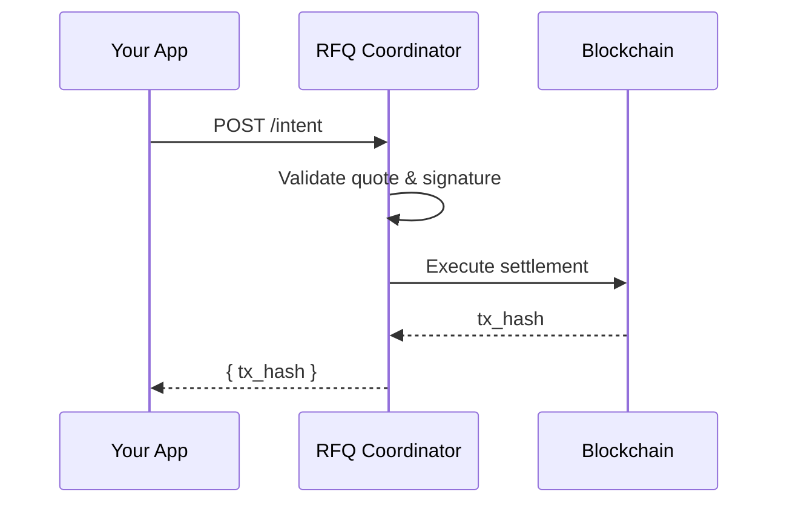

Submit a signed swap intent for execution. This triggers the atomic on-chain settlement.

## Request Body

<ParamField body="quote_id" type="string" required>
  The quote ID from a previous `/quote` request
</ParamField>

<ParamField body="chain_id" type="string" required>
  The blockchain chain ID for a supported network
</ParamField>

<ParamField body="user_address" type="string" required>
  The user's wallet address (must match `signer` in signature_params)
</ParamField>

<ParamField body="swap_intent" type="object" required>
  The swap intent details
  <Expandable title="SwapIntent object">
    <ParamField body="inputToken" type="string" required>
      Token address to sell
    </ParamField>
    <ParamField body="outputToken" type="string" required>
      Token address to buy
    </ParamField>
    <ParamField body="inputAmount" type="string" required>
      Amount to sell (in wei, as string)
    </ParamField>
    <ParamField body="outputAmount" type="string" required>
      Amount to receive (in wei, as string)
    </ParamField>
    <ParamField body="unwrap" type="boolean" required>
      Whether to unwrap WETH to ETH
    </ParamField>
    <ParamField body="frontendReferral" type="string" required>
      Frontend referral code (32-byte hex string)
    </ParamField>
  </Expandable>
</ParamField>

<ParamField body="signature_params" type="object" required>
  Permit2 signature parameters
  <Expandable title="SignatureParams object">
    <ParamField body="deadline" type="string" required>
      Unix timestamp (seconds) when signature expires
    </ParamField>
    <ParamField body="nonce" type="string" required>
      Permit2 nonce for the user
    </ParamField>
    <ParamField body="signer" type="string" required>
      Address that signed (must match user_address)
    </ParamField>
    <ParamField body="signature" type="string" required>
      EIP-712 signature (0x-prefixed hex)
    </ParamField>
  </Expandable>
</ParamField>

## Response

<ResponseField name="status" type="string">
  Response status: `"ok"` on success, `"error"` on failure
</ResponseField>

<ResponseField name="tx_hash" type="string">
  The settlement transaction hash (0x-prefixed)
</ResponseField>

<RequestExample>
```bash cURL
curl -X POST "https://api-rfq.dragonswap.app/api/v1/intent" \
  -H "Content-Type: application/json" \
  -d '{
    "quote_id": "<QUOTE_ID>",
    "chain_id": "<CHAIN_ID>",
    "user_address": "0x...",
    "swap_intent": {
      "inputToken": "0x...",
      "outputToken": "0x...",
      "inputAmount": "...",
      "outputAmount": "...",
      "unwrap": false,
      "frontendReferral": "0x0000000000000000000000000000000000000000000000000000000000000000"
    },
    "signature_params": {
      "deadline": "...",
      "nonce": "...",
      "signer": "0x...",
      "signature": "0x..."
    }
  }'
```

```javascript JavaScript
const intent = {
  quote_id: quote.quote_id,
  chain_id: CHAIN_ID,
  user_address: userAddress,
  swap_intent: {
    inputToken: quote.input_token,
    outputToken: quote.output_token,
    inputAmount: quote.amount_in,
    outputAmount: quote.amount_out,
    unwrap: false,
    frontendReferral: "0x" + "0".repeat(64),
  },
  signature_params: {
    deadline: deadline.toString(),
    nonce: nonce.toString(),
    signer: userAddress,
    signature: signature,
  },
};

const response = await fetch("https://api-rfq.dragonswap.app/api/v1/intent", {
  method: "POST",
  headers: { "Content-Type": "application/json" },
  body: JSON.stringify(intent),
});

const data = await response.json();
if (data.status === "ok") {
  console.log("Settlement TX:", data.tx_hash);
}
```

```python Python
import requests

intent = {
    "quote_id": quote_id,
    "chain_id": CHAIN_ID,
    "user_address": user_address,
    "swap_intent": {
        "inputToken": input_token,
        "outputToken": output_token,
        "inputAmount": amount_in,
        "outputAmount": amount_out,
        "unwrap": False,
        "frontendReferral": "0x" + "0" * 64
    },
    "signature_params": {
        "deadline": deadline,
        "nonce": nonce,
        "signer": user_address,
        "signature": signature
    }
}

response = requests.post(
    "https://api-rfq.dragonswap.app/api/v1/intent",
    json=intent
)
data = response.json()
print(f"TX Hash: {data['tx_hash']}")
```
</RequestExample>

<ResponseExample>
```json 200 - Success
{
  "status": "ok",
  "tx_hash": "0x1234567890abcdef1234567890abcdef1234567890abcdef1234567890abcdef"
}
```

```json 400 - Validation Error
{
  "status": "error",
  "error": "quote_id: Required, swap_intent.inputAmount: Required",
  "code": "VALIDATION_INVALID_PARAM"
}
```

```json 400 - Quote Expired
{
  "status": "error",
  "error": "Quote has expired",
  "code": "QUOTE_EXPIRED"
}
```

```json 400 - Invalid Signature
{
  "status": "error",
  "error": "Invalid signature",
  "code": "INTENT_INVALID_SIGNATURE"
}
```

```json 400 - Amount Mismatch
{
  "status": "error",
  "error": "Input amount does not match quoted amount",
  "code": "QUOTE_AMOUNT_MISMATCH"
}
```

```json 400 - Signer Mismatch
{
  "status": "error",
  "error": "Signer does not match user address",
  "code": "VALIDATION_SIGNER_MISMATCH"
}
```

```json 404 - Quote Not Found
{
  "status": "error",
  "error": "Quote not found",
  "code": "QUOTE_NOT_FOUND"
}
```

```json 500 - Settlement Failed
{
  "status": "error",
  "error": "Settlement failed",
  "code": "INTENT_SETTLEMENT_FAILED"
}
```
</ResponseExample>

## Settlement Process

When you submit an intent:

1. **Validation** - Coordinator validates the quote hasn't expired and amounts match
2. **Signature Verification** - Verifies your EIP-712 signature is valid
3. **On-chain Settlement** - Executes the atomic swap via the RFQSettlement contract
4. **Response** - Returns the transaction hash once confirmed



## Important Notes

<Warning>
  The `swap_intent` amounts must **exactly match** the quote amounts. Any difference will result in rejection.
</Warning>

- The `signer` field must match `user_address`
- Set a reasonable `deadline` (recommended: 5-10 minutes from now)
- Use a random 256-bit integer for `nonce` (Permit2 uses unordered nonces)
- Settlement is atomic - either both tokens are transferred, or neither
- The transaction is submitted and confirmed before the response is returned

## Permit2 Approval

Before submitting an intent, ensure the user has approved Permit2:

```javascript
const allowance = await publicClient.readContract({
  address: inputToken,
  abi: erc20Abi,
  functionName: "allowance",
  args: [userAddress, PERMIT2_ADDRESS],
});

if (allowance < BigInt(inputAmount)) {
  // Need to approve Permit2 first
  await walletClient.writeContract({
    address: inputToken,
    abi: erc20Abi,
    functionName: "approve",
    args: [PERMIT2_ADDRESS, maxUint256],
  });
}
```
