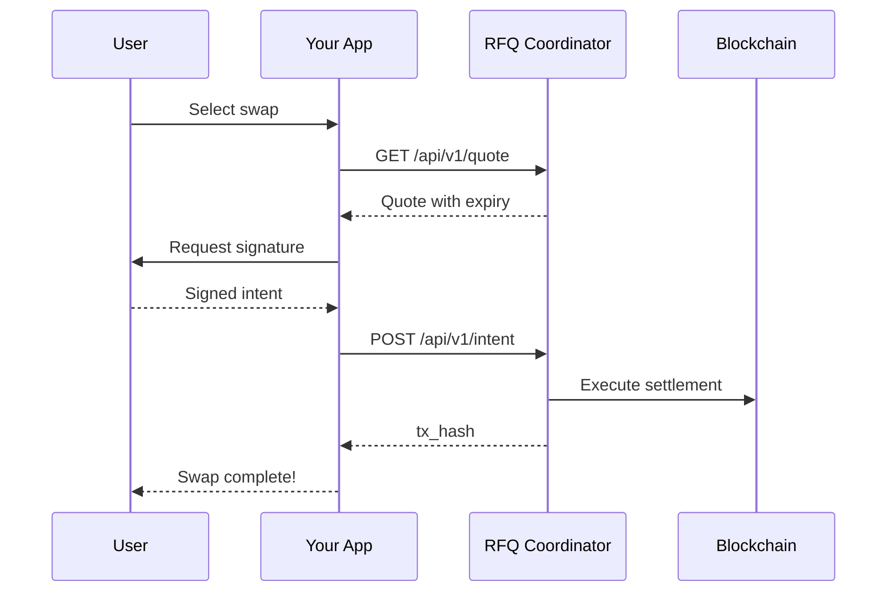

This guide explains how to integrate the RFQ Protocol into your application to enable token swaps for your users.

## Overview

Your application will:
1. Fetch available markets and quotes from the RFQ Coordinator
2. Have users sign Permit2 messages (gasless)
3. Submit signed intents for atomic execution



## Prerequisites

<CardGroup cols={2}>
  <Card title="Web3 Library" icon="code">
    viem, ethers.js, or web3.js for blockchain interactions
  </Card>
  <Card title="Wallet Connection" icon="wallet">
    RainbowKit, Web3Modal, or similar for user wallets
  </Card>
</CardGroup>

## Configuration

Fetch chain configuration from the coordinator:

```bash
curl "https://dev-rfq.saphyre.xyz/api/v1/config?chain_id=<CHAIN_ID>"
```

Response:
```json
{
  "status": "ok",
  "chain_id": "...",
  "chain_name": "...",
  "rfq_settlement_address": "0x...",
  "permit2_address": "0x...",
  "min_quote_ttl_ms": 15000,
  "max_quote_ttl_ms": 30000
}
```

Use these addresses in your integration. Do not hardcode contract addresses.

<Info>
  Request bodies are limited to 10KB.
</Info>

## Integration Flow

### 1. Fetch Available Markets

```bash
GET /api/v1/markets?chain_id=<CHAIN_ID>
```

Returns supported trading pairs with min/max sizes.

### 2. Request a Quote

```bash
GET /api/v1/quote?input_token=0x...&output_token=0x...&amount=1000000000&chain_id=<CHAIN_ID>
```

Response includes:
- `quote_id` - Use this when submitting the intent
- `amount_out` - Display this to the user
- `expiry` - Unix timestamp (ms) when quote expires

### 3. Check/Request Permit2 Approval

Before swapping, ensure the user has approved Permit2 for the input token. This is a one-time operation per token.

```
ERC20.allowance(user, permit2_address)
```

If allowance is insufficient:
```
ERC20.approve(permit2_address, max_uint256)
```

### 4. Sign the Swap Intent

Have the user sign an EIP-712 typed message. The signed data includes:
- `inputToken`, `outputToken`, `inputAmount`, `outputAmount`
- `unwrap` - Whether user wants to receive unwrapped native tokens
- `frontendReferral` - Your referral identifier (bytes32)
- `deadline` - Signature expiry timestamp
- `nonce` - Random 256-bit integer

The `signTakerSwapIntent` function returns an object with two fields:

- `signatureParams` -- Contains `deadline`, `nonce`, `signer`, and `signature`
- `takerSwapIntent` -- Contains `inputToken`, `outputToken`, `inputAmount`, `outputAmount`, `unwrap`, and `frontendReferral`

```javascript
const signedIntent = await signTakerSwapIntent(
  account, deadline, nonce, takerSwapIntent, RFQ_SETTLEMENT_ADDRESS, CHAIN_ID
);

// signedIntent.signatureParams = { deadline, nonce, signer, signature }
// signedIntent.takerSwapIntent = { inputToken, outputToken, inputAmount, outputAmount, unwrap, frontendReferral }
```

See the [EIP-712 Signing Specification](/concepts/eip712-signing) for the complete typed data structure if you need to implement signing without the SDK.

### 5. Submit the Intent

```bash
POST /api/v1/intent
{
  "quote_id": "550e8400-e29b-41d4-a716-446655440000",
  "chain_id": "<CHAIN_ID>",
  "user_address": "0x...",
  "swap_intent": {
    "inputToken": "0x...",
    "outputToken": "0x...",
    "inputAmount": "1000000",
    "outputAmount": "990000",
    "unwrap": false,
    "frontendReferral": "0x0000000000000000000000000000000000000000000000000000000000000000"
  },
  "signature_params": {
    "deadline": "1700000000",
    "nonce": "12345",
    "signer": "0x...",
    "signature": "0x..."
  }
}
```

On success, returns `tx_hash` of the settlement transaction.

## Key Considerations

### Nonce Management

Use **random nonces** for Permit2 signatures. Permit2 uses unordered nonces with bitmap tracking - there is no sequential "current nonce" to fetch.

```
nonce = random 256-bit integer
```

### Quote Expiry

- `expiry` field is a Unix timestamp in milliseconds
- Refresh quotes before they expire (recommend 5 seconds buffer)
- Display a countdown timer to users

### Frontend Referral

The `frontendReferral` field is **bytes32**, not an address. Use a zero-bytes value (`0x0000000000000000000000000000000000000000000000000000000000000000`) if you don't have a registered referral address. Contact team@saphyre.xyz to register a frontend referral identifier.

### Unwrap

Set `unwrap: true` only when the output token is the chain's native wrapped token (e.g., WSEI/WETH). When true, the settlement contract will unwrap the token to native currency before sending to the taker. Set to `false` for all other tokens.

## Best Practices

<AccordionGroup>
  <Accordion title="Display Countdown Timer">
    Show users how much time they have to sign and submit their swap.
  </Accordion>

  <Accordion title="Auto-Refresh Quotes">
    Fetch new quotes before expiry. Schedule refresh at `expiry - 5000ms`.
  </Accordion>

  <Accordion title="Validate Input Amounts">
    Check amounts against market min/max before requesting quotes.
  </Accordion>

  <Accordion title="Show Loading States">
    Provide clear feedback during each step: fetching quote, awaiting signature, submitting, confirming.
  </Accordion>
</AccordionGroup>

## Checklist

<Steps>
  <Step title="Configuration">
    Fetch config from `/api/v1/config` - do not hardcode addresses
  </Step>
  <Step title="Markets">
    Fetch and display available markets
  </Step>
  <Step title="Quotes">
    Fetch quotes and display prices to users
  </Step>
  <Step title="Permit2 Approval">
    Handle one-time Permit2 approval flow
  </Step>
  <Step title="Intent Signing">
    Users can sign EIP-712 swap intents with random nonces
  </Step>
  <Step title="Intent Submission">
    Submit intents and receive transaction hash
  </Step>
  <Step title="Quote Refresh">
    Auto-refresh quotes before expiry
  </Step>
</Steps>

<Note>
  SDK with code examples coming soon.
</Note>
