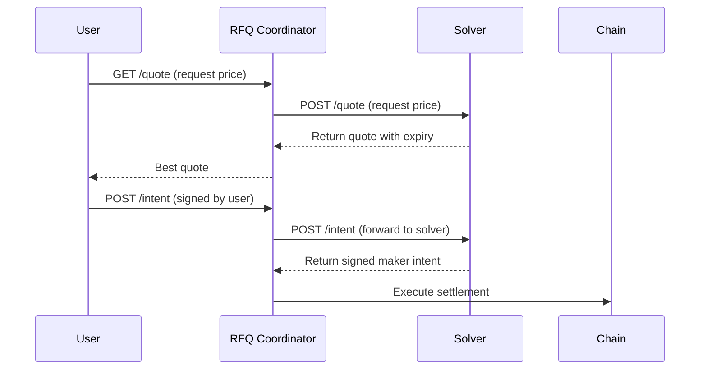

# Getting Started as a Solver

Welcome to the RFQ Protocol solver integration guide. Solvers (market makers) provide liquidity to the protocol by responding to quote requests and executing trades.

## What is a Solver?

A solver is a market maker service that:
- Receives quote requests from the RFQ Coordinator
- Returns competitive prices based on your pricing strategy
- Signs swap intents when users want to execute trades
- Has tokens transferred atomically via Permit2

## Quick Overview

## Transport Options

Choose the transport that fits your stack:

| | HTTP (REST) | WebSocket (WSS) |
|---|---|---|
| **Direction** | Coordinator calls your API | You connect to coordinator |
| **Serialization** | JSON | MessagePack (binary) |
| **Infrastructure** | Requires public HTTPS endpoint | No public endpoint needed |
| **Recommended for** | Simple integrations | Rust, Go, Python, high-performance |

## Requirements

| Requirement | Description |
|-------------|-------------|
| **Solver Wallet** | EOA with sufficient token balances |
| **API Endpoint** | HTTPS endpoint (HTTP) or WebSocket connection (WSS) |
| **Price Feed** | Real-time price data for your markets |
| **Permit2 Approval** | Approve Permit2 to spend your tokens |

## Operations

Your solver must handle these operations (via HTTP endpoints or WSS messages):

| Operation | HTTP Endpoint | WSS Action |
|-----------|---------------|------------|
| Return supported markets | `POST /api/v1/markets` | `get_markets` -> `markets_response` |
| Return price quote | `POST /api/v1/quote` | `get_quote` -> `quote_response` |
| Sign maker intent | `POST /api/v1/intent` | `sign_intent` -> `intent_response` |

## Next Steps

<CardGroup cols={3}>
  <Card title="HTTP Integration" icon="book" href="/solver/integration-guide">
    REST API guide with code examples
  </Card>
  <Card title="WebSocket Integration" icon="bolt" href="/solver/websocket-guide">
    WSS guide for real-time communication
  </Card>
  <Card title="API Specification" icon="code" href="/solver/api/overview">
    Full API documentation
  </Card>
</CardGroup>

## Quick Start Checklist

<Steps>
  <Step title="Contact the Team">
    Reach out to get whitelisted as a solver
  </Step>
  <Step title="Approve Permit2">
    Approve Permit2 contract for your trading tokens
  </Step>
  <Step title="Implement Endpoints">
    Build the three required API endpoints
  </Step>
  <Step title="Test Integration">
    Verify your integration works correctly
  </Step>
  <Step title="Go Live">
    Start receiving quote requests
  </Step>
</Steps>
