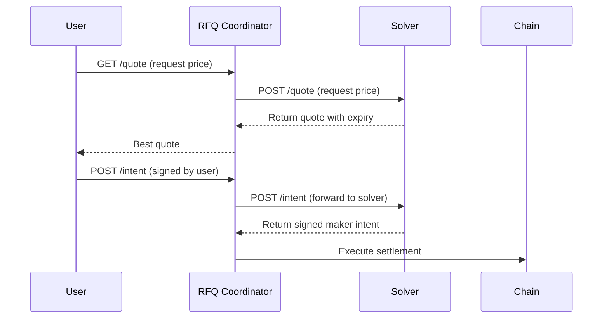

# Getting Started as a Solver

Welcome to the RFQ Protocol solver integration guide. Solvers (market makers) provide liquidity to the protocol by responding to quote requests and executing trades.

## What is a Solver?

A solver is a market maker service that:
- Receives quote requests from the RFQ Coordinator
- Returns competitive prices based on your pricing strategy
- Signs swap intents when users want to execute trades
- Has tokens transferred atomically via Permit2

## Quick Overview

## Requirements

| Requirement | Description |
|-------------|-------------|
| **Solver Wallet** | EOA with sufficient token balances |
| **HTTPS Endpoint** | Publicly accessible API endpoint |
| **Price Feed** | Real-time price data for your markets |
| **Permit2 Approval** | Approve Permit2 to spend your tokens |

## Endpoints to Implement

Your solver must expose these endpoints:

| Endpoint | Purpose |
|----------|---------|
| `POST /api/v1/markets` | Return markets you support |
| `POST /api/v1/quote` | Return price quote for a trade |
| `POST /api/v1/intent` | Sign maker intent for settlement |

## Next Steps

<CardGroup cols={2}>
  <Card title="Full Integration Guide" icon="book" href="/solver/integration-guide">
    Detailed guide with code examples
  </Card>
  <Card title="API Specification" icon="code" href="/solver/api/overview">
    Full API documentation
  </Card>
</CardGroup>

## Quick Start Checklist

<Steps>
  <Step title="Contact the Team">
    Reach out to get whitelisted as a solver
  </Step>
  <Step title="Approve Permit2">
    Approve Permit2 contract for your trading tokens
  </Step>
  <Step title="Implement Endpoints">
    Build the three required API endpoints
  </Step>
  <Step title="Test Integration">
    Verify your integration works correctly
  </Step>
  <Step title="Go Live">
    Start receiving quote requests
  </Step>
</Steps>
