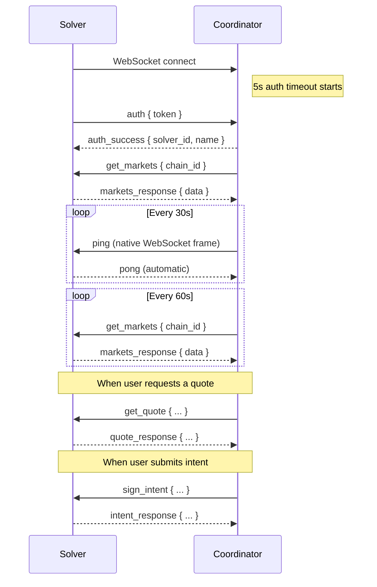

The RFQ Protocol supports a **WebSocket (WSS)** transport as an alternative to the REST API for solver communication. WSS is recommended for solvers built in Rust, Go, Python, or any language where persistent connections are preferred.

## HTTP vs WebSocket

| | HTTP (REST) | WebSocket (WSS) |
|---|---|---|
| **Protocol** | Request/response | Persistent connection |
| **Serialization** | JSON | MessagePack (binary) |
| **Direction** | Solver exposes endpoints | Solver connects to coordinator |
| **Infrastructure** | Requires public HTTPS endpoint | No public endpoint needed |
| **Latency** | New connection per request | Reuses connection |
| **Recommended for** | Simple integrations | High-performance, Rust/Go/Python |

<Note>
  Both transports support the same operations: markets, quotes, and intents. Choose the one that fits your stack.
</Note>

## Connection

Solvers connect **to** the RFQ Coordinator (the coordinator does not connect to you):

```
wss://dev-rfq.saphyre.xyz/api/v1/solver-stream
```

All messages are **MessagePack-encoded binary WebSocket frames** (RFC 6455).

### Message Envelope

Every message follows this structure:

```typescript
{
  action: string;         // Message type (e.g. "get_quote", "quote_response")
  request_id?: string;    // UUID for request/response correlation
  data?: unknown;         // Payload
  success?: boolean;      // Response: true/false
  error?: {               // Error details (when success=false)
    code: string;
    message: string;
  };
}
```

## Connection Lifecycle



## Authentication

The **first message** must be an auth message within 5 seconds, or the connection is closed.

**Request (Solver -> Coordinator):**
```json
{
  "action": "auth",
  "data": {
    "token": "your-plain-text-auth-key"
  }
}
```

**Success Response:**
```json
{
  "action": "auth_success",
  "data": {
    "solver_id": 9,
    "solver_name": "my-solver"
  }
}
```

**Failure Response:**
```json
{
  "action": "auth_error",
  "error": {
    "code": "UNAUTHORIZED",
    "message": "Invalid auth token"
  }
}
```

Connection is closed with code `4003` after auth failure. Error code is `UNAUTHORIZED` for invalid tokens, wrong protocol, or malformed auth messages.

<Warning>
  Your solver must be registered with `protocol = 'wss'` in the coordinator's database. Contact the team to configure this.
</Warning>

## Heartbeat

The coordinator sends a native WebSocket ping frame every 30 seconds. Your WebSocket library responds with a pong frame automatically — no application code is needed. Connections with no pong for 60 seconds are closed as stale.

## Markets

Markets are synced automatically:
1. **On connect** - immediately after authentication
2. **Every 60 seconds** - periodic refresh while connected

<Note>
  If the coordinator does not receive updated market data within the freshness window, your markets will be considered stale and you will stop receiving quote requests. For WSS solvers, this is handled automatically via the periodic `get_markets` messages above.
</Note>

### Request (Coordinator -> Solver)

```json
{
  "action": "get_markets",
  "request_id": "2198702c-bcad-4110-baae-e62e7b34ea71",
  "data": {
    "chain_id": "1329"
  }
}
```

### Response (Solver -> Coordinator)

```json
{
  "action": "markets_response",
  "request_id": "2198702c-bcad-4110-baae-e62e7b34ea71",
  "success": true,
  "data": [
    {
      "chain_id": "1329",
      "input_token": "0xe30fedd158a2e3b13e9badaeabafc5516e95e8c7",
      "output_token": "0xe15fc38f6d8c56af07bbcbe3baf5708a2bf42392",
      "min_size": 100,
      "max_size": 10000
    }
  ]
}
```

**Fields per market item:**

| Field | Type | Required | Description |
|-------|------|----------|-------------|
| `chain_id` | string | no | Chain ID (if omitted, inferred from request) |
| `input_token` | string | yes | Token address (lowercase hex) |
| `output_token` | string | yes | Token address (lowercase hex) |
| `min_size` | number \| null | no | Minimum order size in USD |
| `max_size` | number \| null | no | Maximum order size in USD |

## Quotes

Sent when a user requests a price quote via the public API.

### Request (Coordinator -> Solver)

```json
{
  "action": "get_quote",
  "request_id": "a1b2c3d4-e5f6-7890-abcd-ef1234567890",
  "data": {
    "quote_id": "550e8400-e29b-41d4-a716-446655440000",
    "chain_id": "1329",
    "input_token": "0xe30fedd158a2e3b13e9badaeabafc5516e95e8c7",
    "output_token": "0xe15fc38f6d8c56af07bbcbe3baf5708a2bf42392",
    "amount": "1000000000000000000",
    "expiry_timestamp": 1738780830000
  }
}
```

| Field | Type | Description |
|-------|------|-------------|
| `quote_id` | string | Coordinator-generated UUID, echo it back in response |
| `chain_id` | string | Chain ID |
| `input_token` | string | Token being sold (lowercase hex) |
| `output_token` | string | Token being bought (lowercase hex) |
| `amount` | string | Input amount in wei (net amount after protocol fee deduction) |
| `expiry_timestamp` | number | Unix timestamp (milliseconds) when the quote expires |

### Response (Solver -> Coordinator)

**Success:**
```json
{
  "action": "quote_response",
  "request_id": "a1b2c3d4-e5f6-7890-abcd-ef1234567890",
  "success": true,
  "data": {
    "quote_id": "550e8400-e29b-41d4-a716-446655440000",
    "input_token": "0xe30fedd158a2e3b13e9badaeabafc5516e95e8c7",
    "output_token": "0xe15fc38f6d8c56af07bbcbe3baf5708a2bf42392",
    "amount_in": "1000000000000000000",
    "amount_out": "249250000",
    "expiry": 1738780830000,
    "chain_id": "1329"
  }
}
```

| Field | Type | Required | Description |
|-------|------|----------|-------------|
| `quote_id` | string | yes | Echo back the coordinator-provided quote_id |
| `amount_out` | string | yes | Your quoted output amount in wei |
| `expiry` | number | yes | Echo back the expiry timestamp (must be a number, not a string) |
| `input_token` | string | no | Echo back (for your convenience) |
| `output_token` | string | no | Echo back (for your convenience) |
| `amount_in` | string | no | Echo back (for your convenience) |
| `chain_id` | string | no | Echo back (for your convenience) |

<Warning>
  The coordinator validates `quote_id`, `amount_out`, and `expiry` from the response. The `expiry` field **must be a number** (not a string). Other fields are optional echoes.
</Warning>

**Error:**
```json
{
  "action": "quote_response",
  "request_id": "a1b2c3d4-e5f6-7890-abcd-ef1234567890",
  "success": false,
  "error": {
    "code": "MARKET_NOT_FOUND",
    "message": "No market for this pair"
  }
}
```

## Intent Signing

Sent when a user submits a signed trade intent. The solver must create a counter-signature (reversed swap direction).

### Request (Coordinator -> Solver)

```json
{
  "action": "sign_intent",
  "request_id": "b2c3d4e5-f6a7-8901-bcde-f12345678901",
  "data": {
    "quote_id": "550e8400-e29b-41d4-a716-446655440000",
    "chain_id": "1329",
    "user_address": "0x1234567890abcdef1234567890abcdef12345678",
    "intent": {
      "inputToken": "0xe30fedd158a2e3b13e9badaeabafc5516e95e8c7",
      "outputToken": "0xe15fc38f6d8c56af07bbcbe3baf5708a2bf42392",
      "inputAmount": "975000000000000000",
      "outputAmount": "249250000"
    },
  }
}
```

| Field | Type | Description |
|-------|------|-------------|
| `quote_id` | string | Original quote ID |
| `chain_id` | string | Chain ID |
| `user_address` | string | Taker's address |
| `intent.inputToken` | string | Taker's input token |
| `intent.outputToken` | string | Taker's output token |
| `intent.inputAmount` | string | Taker's input amount in wei (net amount after protocol fee deduction). Use this as the maker's `outputAmount`. |
| `intent.outputAmount` | string | Taker's output amount in wei |

### Solver Logic

The signing logic is identical to the HTTP transport. See [Sign Intent](/solver/api/post-intent) for the full intent reversal algorithm and EIP-712 signing details.

### Response (Solver -> Coordinator)

**Success:**
```json
{
  "action": "intent_response",
  "request_id": "b2c3d4e5-f6a7-8901-bcde-f12345678901",
  "success": true,
  "data": {
    "quote_id": "550e8400-e29b-41d4-a716-446655440000",
    "solver_address": "0x7d344433d68955878756c017aa09e130236f44e9",
    "signed_swap_intent": {
      "swap_intent": {
        "counterparty": "0x1234567890abcdef1234567890abcdef12345678",
        "inputToken": "0xe15fc38f6d8c56af07bbcbe3baf5708a2bf42392",
        "outputToken": "0xe30fedd158a2e3b13e9badaeabafc5516e95e8c7",
        "inputAmount": "249250000",
        "outputAmount": "975000000000000000",
        "unwrap": false
      },
      "signature_params": {
        "deadline": "1705612890",
        "nonce": "98765432109876543210",
        "signer": "0x7d344433d68955878756c017aa09e130236f44e9",
        "signature": "0x..."
      }
    }
  }
}
```

## Close Codes

| Code | Name | Description |
|------|------|-------------|
| 4001 | AUTH_TIMEOUT | Auth message not received within timeout period |
| 4002 | STALE_CONNECTION | No pong received within heartbeat timeout |
| 4003 | UNAUTHORIZED | Invalid auth token, wrong protocol, or malformed auth |
| 4005 | TRY_AGAIN_LATER | Too many connections from the same IP |
| 4006 | UNKNOWN_ACTION | Solver sent an unrecognized message action |
| 4008 | SUPERSEDED | Same solver connected again, old connection replaced |

## Rate Limiting

- **Max connections per IP:** 3
- If a solver connects with a solver_id that already has an active connection, the old connection is closed with code `4008`

## Reconnection

Implement exponential backoff with jitter for reconnection:

```
delay = min(1000 * 2^attempt, 30000) + random jitter (25%)
```

## Configuration

### Chain Config Endpoint

Fetch contract addresses dynamically from the coordinator instead of hardcoding them:

**Request:**
```bash
curl -X GET "https://dev-rfq.saphyre.xyz/api/v1/config?chain_id=1329"
```

**Response:**
```json
{
  "status": "ok",
  "chain_id": "1329",
  "chain_name": "Sei Mainnet",
  "rfq_settlement_address": "0x...",
  "permit2_address": "0xC6b7aC7Bbd8b456b67e8440694503cAC2Afb1d98",
  "min_quote_ttl_ms": 15000,
  "max_quote_ttl_ms": 30000
}
```

Use `rfq_settlement_address` and `permit2_address` from this response when signing intents. See [Get Config](/frontend/api/get-config) for full details.

### Solver Environment

```bash
# Connection to RFQ Coordinator
RFQ_SERVER_WS_URL=wss://dev-rfq.saphyre.xyz/api/v1/solver-stream
MM_AUTH_KEY=your-plain-text-auth-key

# Chain (required for intent signing)
CHAIN_ID=1329
CHAIN_RPC_URL=https://evm-rpc.sei-apis.com
SOLVER_PRIVATE_KEY=0x...

# Quote pricing
SPREAD_BPS=30  # 0.3% spread
```

<Note>
  `rfq_settlement_address` and `permit2_address` should be fetched from the `/api/v1/config` endpoint rather than hardcoded. This ensures your solver stays up to date if contract addresses change.
</Note>

## Example: Node.js Solver

```javascript
import WebSocket from "ws";
import { encode, decode } from "@msgpack/msgpack";

const WS_URL = "wss://dev-rfq.saphyre.xyz/api/v1/solver-stream";
const AUTH_KEY = process.env.MM_AUTH_KEY;

function connect() {
  const ws = new WebSocket(WS_URL);

  ws.on("open", () => {
    // First message must be auth
    ws.send(encode({ action: "auth", data: { token: AUTH_KEY } }));
  });

  ws.on("message", (raw) => {
    const msg = decode(raw);

    switch (msg.action) {
      case "auth_success":
        console.log(`Authenticated as ${msg.data.solver_name}`);
        break;

      case "get_markets":
        ws.send(encode({
          action: "markets_response",
          request_id: msg.request_id,
          success: true,
          data: [
            {
              chain_id: msg.data.chain_id,
              input_token: "0xe30fedd158a2e3b13e9badaeabafc5516e95e8c7",
              output_token: "0xe15fc38f6d8c56af07bbcbe3baf5708a2bf42392",
              min_size: 100,
              max_size: 10000,
            },
          ],
        }));
        break;

      case "get_quote":
        const { quote_id, chain_id, amount, expiry_timestamp } = msg.data;
        const amountOut = calculateOutput(amount); // your pricing logic
        ws.send(encode({
          action: "quote_response",
          request_id: msg.request_id,
          success: true,
          data: {
            quote_id,
            amount_out: amountOut,
            expiry: expiry_timestamp, // must be a number
            chain_id,
          },
        }));
        break;

      case "sign_intent":
        const signedIntent = signReversedIntent(msg.data); // your signing logic
        ws.send(encode({
          action: "intent_response",
          request_id: msg.request_id,
          success: true,
          data: signedIntent,
        }));
        break;
    }
  });

  ws.on("close", (code, reason) => {
    console.log(`Disconnected: ${code} ${reason}`);
    // Reconnect with exponential backoff
    setTimeout(connect, 1000 + Math.random() * 500);
  });
}

connect();
```

## Example: Rust Solver

```rust
use tokio_tungstenite::{connect_async, tungstenite::Message};
use futures_util::{StreamExt, SinkExt};
use rmp_serde::{to_vec, from_slice};
use serde_json::{json, Value};

#[tokio::main]
async fn main() -> anyhow::Result<()> {
    let url = "wss://dev-rfq.saphyre.xyz/api/v1/solver-stream";
    let (ws, _) = connect_async(url).await?;
    let (mut tx, mut rx) = ws.split();

    // Authenticate
    let auth = json!({ "action": "auth", "data": { "token": "your-key" } });
    tx.send(Message::Binary(to_vec(&auth)?)).await?;

    while let Some(Ok(Message::Binary(data))) = rx.next().await {
        let msg: Value = from_slice(&data)?;
        let request_id = msg["request_id"].clone();

        match msg["action"].as_str().unwrap_or("") {
            "auth_success" => {
                println!("Authenticated as {}", msg["data"]["solver_name"]);
            }
            "get_markets" => {
                let resp = json!({
                    "action": "markets_response",
                    "request_id": request_id,
                    "success": true,
                    "data": [{
                        "chain_id": msg["data"]["chain_id"],
                        "input_token": "0xe30fedd158a2e3b13e9badaeabafc5516e95e8c7",
                        "output_token": "0xe15fc38f6d8c56af07bbcbe3baf5708a2bf42392",
                        "min_size": 100,
                        "max_size": 10000
                    }]
                });
                tx.send(Message::Binary(to_vec(&resp)?)).await?;
            }
            "get_quote" => {
                let d = &msg["data"];
                let amount_out = calculate_output(&d["amount"]); // your pricing
                let resp = json!({
                    "action": "quote_response",
                    "request_id": request_id,
                    "success": true,
                    "data": {
                        "quote_id": d["quote_id"],
                        "amount_out": amount_out,
                        "expiry": d["expiry_timestamp"],
                        "chain_id": d["chain_id"]
                    }
                });
                tx.send(Message::Binary(to_vec(&resp)?)).await?;
            }
            "sign_intent" => {
                let signed = sign_reversed_intent(&msg["data"]); // your signing
                let resp = json!({
                    "action": "intent_response",
                    "request_id": request_id,
                    "success": true,
                    "data": signed
                });
                tx.send(Message::Binary(to_vec(&resp)?)).await?;
            }
            _ => {}
        }
    }

    Ok(())
}
```

## Verification Checklist

<Steps>
  <Step title="Connect & Authenticate">
    Solver connects and receives `auth_success`
  </Step>
  <Step title="Markets Sync">
    Respond to `get_markets` immediately after auth - markets appear in `GET /api/v1/markets`
  </Step>
  <Step title="Heartbeat">
    `ping`/`pong` works every 30 seconds
  </Step>
  <Step title="Quote">
    `get_quote` returns valid `amount_out` with correct `quote_id` and numeric `expiry`
  </Step>
  <Step title="Intent Signing">
    `sign_intent` returns valid EIP-712 signature with reversed intent
  </Step>
  <Step title="Reconnection">
    Solver reconnects with backoff after server restart
  </Step>
</Steps>
