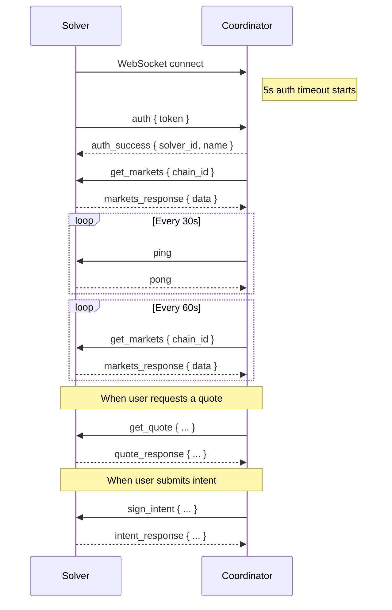

The RFQ Protocol supports a **WebSocket (WSS)** transport as an alternative to the REST API for solver communication. WSS is recommended for solvers built in Rust, Go, Python, or any language where persistent connections are preferred.

## HTTP vs WebSocket

| | HTTP (REST) | WebSocket (WSS) |
|---|---|---|
| **Protocol** | Request/response | Persistent connection |
| **Serialization** | JSON | MessagePack (binary) |
| **Direction** | Solver exposes endpoints | Solver connects to coordinator |
| **Infrastructure** | Requires public HTTPS endpoint | No public endpoint needed |
| **Latency** | New connection per request | Reuses connection |
| **Recommended for** | Simple integrations | High-performance, Rust/Go/Python |

<Note>
  Both transports are part of API v1 and support the same operations: markets, quotes, and intents. Choose the one that fits your stack.
</Note>

## Connection

Solvers connect **to** the RFQ Coordinator (the coordinator does not connect to you):

```
wss://api-rfq.dragonswap.app/api/v2/solver-stream
```

All messages are **MessagePack-encoded binary WebSocket frames** (RFC 6455).

### Message Envelope

Every message follows this structure:

```typescript
{
  action: string;         // Message type (e.g. "get_quote", "quote_response")
  request_id?: string;    // UUID for request/response correlation
  data?: unknown;         // Payload
  success?: boolean;      // Response: true/false
  error?: {               // Error details (when success=false)
    code: string;
    message: string;
  };
}
```

## Connection Lifecycle



## Authentication

The **first message** must be an auth message within 5 seconds, or the connection is closed.

**Request (Solver -> Coordinator):**
```json
{
  "action": "auth",
  "data": {
    "token": "your-plain-text-auth-key"
  }
}
```

**Success Response:**
```json
{
  "action": "auth_success",
  "data": {
    "solver_id": 9,
    "solver_name": "my-solver"
  }
}
```

**Failure Response:**
```json
{
  "action": "auth_error",
  "error": {
    "code": "UNAUTHORIZED",
    "message": "Invalid auth token"
  }
}
```

Connection is closed with code `4001` after auth failure. Error code is `UNAUTHORIZED` for invalid tokens, or `INVALID_AUTH` for malformed auth messages.

<Warning>
  Your solver must be registered with `protocol = 'wss'` in the coordinator's database. Contact the team to configure this.
</Warning>

## Heartbeat

The coordinator sends `ping` every 30 seconds. Respond with `pong`. Connections with no pong for 60 seconds are closed as stale.

```json
// Coordinator -> Solver
{ "action": "ping" }

// Solver -> Coordinator
{ "action": "pong" }
```

## Markets

Markets are synced automatically:
1. **On connect** - immediately after authentication
2. **Every 60 seconds** - periodic refresh while connected

### Request (Coordinator -> Solver)

```json
{
  "action": "get_markets",
  "request_id": "2198702c-bcad-4110-baae-e62e7b34ea71",
  "data": {
    "chain_id": "1329"
  }
}
```

### Response (Solver -> Coordinator)

```json
{
  "action": "markets_response",
  "request_id": "2198702c-bcad-4110-baae-e62e7b34ea71",
  "success": true,
  "data": [
    {
      "chain_id": "1329",
      "input_token": "0xe30fedd158a2e3b13e9badaeabafc5516e95e8c7",
      "output_token": "0xe15fc38f6d8c56af07bbcbe3baf5708a2bf42392",
      "min_size": 100,
      "max_size": 10000
    }
  ]
}
```

**Fields per market item:**

| Field | Type | Required | Description |
|-------|------|----------|-------------|
| `chain_id` | string | no | Chain ID (if omitted, inferred from request) |
| `input_token` | string | yes | Token address (lowercase hex) |
| `output_token` | string | yes | Token address (lowercase hex) |
| `min_size` | number \| null | no | Minimum order size in USD |
| `max_size` | number \| null | no | Maximum order size in USD |

**Timeout:** 10 seconds

## Quotes

Sent when a user requests a price quote via the public API.

### Request (Coordinator -> Solver)

```json
{
  "action": "get_quote",
  "request_id": "a1b2c3d4-e5f6-7890-abcd-ef1234567890",
  "data": {
    "quote_id": "550e8400-e29b-41d4-a716-446655440000",
    "chain_id": "1329",
    "input_token": "0xe30fedd158a2e3b13e9badaeabafc5516e95e8c7",
    "output_token": "0xe15fc38f6d8c56af07bbcbe3baf5708a2bf42392",
    "amount": "1000000000000000000",
    "expiry_timestamp": 1738780830000
  }
}
```

| Field | Type | Description |
|-------|------|-------------|
| `quote_id` | string | Coordinator-generated UUID, echo it back in response |
| `chain_id` | string | Chain ID |
| `input_token` | string | Token being sold (lowercase hex) |
| `output_token` | string | Token being bought (lowercase hex) |
| `amount` | string | Input amount in wei (post-fee) |
| `expiry_timestamp` | number | Unix timestamp (milliseconds) when the quote expires |

### Response (Solver -> Coordinator)

**Success:**
```json
{
  "action": "quote_response",
  "request_id": "a1b2c3d4-e5f6-7890-abcd-ef1234567890",
  "success": true,
  "data": {
    "quote_id": "550e8400-e29b-41d4-a716-446655440000",
    "input_token": "0xe30fedd158a2e3b13e9badaeabafc5516e95e8c7",
    "output_token": "0xe15fc38f6d8c56af07bbcbe3baf5708a2bf42392",
    "amount_in": "1000000000000000000",
    "amount_out": "249250000",
    "expiry": 1738780830000,
    "chain_id": "1329"
  }
}
```

| Field | Type | Required | Description |
|-------|------|----------|-------------|
| `quote_id` | string | yes | Echo back the coordinator-provided quote_id |
| `amount_out` | string | yes | Your quoted output amount in wei |
| `expiry` | number | yes | Echo back the expiry timestamp (must be a number, not a string) |
| `input_token` | string | no | Echo back (for your convenience) |
| `output_token` | string | no | Echo back (for your convenience) |
| `amount_in` | string | no | Echo back (for your convenience) |
| `chain_id` | string | no | Echo back (for your convenience) |

<Warning>
  The coordinator validates `quote_id`, `amount_out`, and `expiry` from the response. The `expiry` field **must be a number** (not a string). Other fields are optional echoes.
</Warning>

**Error:**
```json
{
  "action": "quote_response",
  "request_id": "a1b2c3d4-e5f6-7890-abcd-ef1234567890",
  "success": false,
  "error": {
    "code": "MARKET_NOT_FOUND",
    "message": "No market for this pair"
  }
}
```

**Timeout:** 5 seconds

## Intent Signing

Sent when a user submits a signed trade intent. The solver must create a counter-signature (reversed swap direction).

### Request (Coordinator -> Solver)

```json
{
  "action": "sign_intent",
  "request_id": "b2c3d4e5-f6a7-8901-bcde-f12345678901",
  "data": {
    "quote_id": "550e8400-e29b-41d4-a716-446655440000",
    "chain_id": "1329",
    "user_address": "0x1234567890abcdef1234567890abcdef12345678",
    "fee": "25000000",
    "intent": {
      "inputToken": "0xe30fedd158a2e3b13e9badaeabafc5516e95e8c7",
      "outputToken": "0xe15fc38f6d8c56af07bbcbe3baf5708a2bf42392",
      "inputAmount": "975000000000000000",
      "outputAmount": "249250000"
    },
    "taker_data": {
      "unwrap": false,
      "frontendReferral": "0x0000000000000000000000000000000000000000000000000000000000000000",
      "deadline": "1705612890",
      "nonce": "0xabc123...",
      "signer": "0x1234567890abcdef1234567890abcdef12345678",
      "signature": "0x..."
    }
  }
}
```

| Field | Type | Description |
|-------|------|-------------|
| `quote_id` | string | Original quote ID |
| `chain_id` | string | Chain ID |
| `user_address` | string | Taker's address |
| `fee` | string | Protocol fee in input token wei |
| `intent.inputToken` | string | Taker's input token |
| `intent.outputToken` | string | Taker's output token |
| `intent.inputAmount` | string | Taker's input amount in wei (post-fee) |
| `intent.outputAmount` | string | Taker's output amount in wei |
| `taker_data` | object | Taker's signature data (for on-chain verification) |

### Solver Logic

The signing logic is identical to the HTTP transport. See [Sign Intent](/solver/api/post-intent) for the full intent reversal algorithm and EIP-712 signing details.

### Response (Solver -> Coordinator)

**Success:**
```json
{
  "action": "intent_response",
  "request_id": "b2c3d4e5-f6a7-8901-bcde-f12345678901",
  "success": true,
  "data": {
    "quote_id": "550e8400-e29b-41d4-a716-446655440000",
    "solver_address": "0x7d344433d68955878756c017aa09e130236f44e9",
    "signed_swap_intent": {
      "swap_intent": {
        "counterparty": "0x1234567890abcdef1234567890abcdef12345678",
        "inputToken": "0xe15fc38f6d8c56af07bbcbe3baf5708a2bf42392",
        "outputToken": "0xe30fedd158a2e3b13e9badaeabafc5516e95e8c7",
        "inputAmount": "249250000",
        "outputAmount": "975000000000000000",
        "unwrap": false
      },
      "signature_params": {
        "deadline": "1705612890",
        "nonce": "0xabc123...",
        "signer": "0x7d344433d68955878756c017aa09e130236f44e9",
        "signature": "0x..."
      }
    }
  }
}
```

**Timeout:** 10 seconds

## Close Codes

| Code | Name | Description |
|------|------|-------------|
| 4001 | AUTH_TIMEOUT / UNAUTHORIZED | Auth not received within 5s, or invalid token |
| 4002 | STALE_CONNECTION | No pong received for 60s |
| 4003 | TRY_AGAIN_LATER | Too many connections from the same IP |
| 4004 | UNKNOWN_ACTION | Solver sent an unrecognized action |
| 4008 | SUPERSEDED | Same solver connected again, old connection replaced |

## Rate Limiting

- **Max connections per IP:** 3
- If a solver connects with a solver_id that already has an active connection, the old connection is closed with code `4008`

## Reconnection

Implement exponential backoff with jitter for reconnection:

```
delay = min(1000 * 2^attempt, 30000) + random jitter (25%)
```

## Configuration

### Solver Environment

```bash
# Connection to RFQ Coordinator
RFQ_SERVER_WS_URL=wss://api-rfq.dragonswap.app/api/v2/solver-stream
MM_AUTH_KEY=your-plain-text-auth-key

# Chain (required for intent signing)
CHAIN_ID=1329
CHAIN_RPC_URL=https://evm-rpc.sei-apis.com
SOLVER_PRIVATE_KEY=0x...
RFQ_SETTLEMENT_ADDRESS=0x...
PERMIT2_ADDRESS=0xC6b7aC7Bbd8b456b67e8440694503cAC2Afb1d98

# Quote pricing
SPREAD_BPS=30  # 0.3% spread
```

## Example: PHP/Laravel Solver

```php
$conn->on('message', function ($msg) use ($unpacker, $conn) {
    $unpacker->reset((string) $msg);
    $data = $unpacker->unpack();

    switch ($data['action']) {
        case 'ping':
            $conn->send(msgpack(['action' => 'pong']));
            break;

        case 'get_markets':
            $conn->send(msgpack([
                'action' => 'markets_response',
                'request_id' => $data['request_id'],
                'success' => true,
                'data' => [
                    [
                        'input_token' => '0xe30fedd158a2e3b13e9badaeabafc5516e95e8c7',
                        'output_token' => '0xe15fc38f6d8c56af07bbcbe3baf5708a2bf42392',
                        'min_size' => 100,
                        'max_size' => 10000,
                    ],
                ],
            ]));
            break;

        case 'get_quote':
            $conn->send(msgpack([
                'action' => 'quote_response',
                'request_id' => $data['request_id'],
                'success' => true,
                'data' => [
                    'quote_id' => $data['data']['quote_id'],
                    'amount_out' => $calculatedOutput,
                    'expiry' => (int) $data['data']['expiry_timestamp'],
                    'chain_id' => $data['data']['chain_id'],
                ],
            ]));
            break;

        case 'sign_intent':
            // Sign reversed swap intent and respond
            $conn->send(msgpack([
                'action' => 'intent_response',
                'request_id' => $data['request_id'],
                'success' => true,
                'data' => [
                    'quote_id' => $data['data']['quote_id'],
                    'solver_address' => $solverAddress,
                    'signed_swap_intent' => [
                        'swap_intent' => [ /* reversed intent */ ],
                        'signature_params' => [ /* EIP-712 signature */ ],
                    ],
                ],
            ]));
            break;
    }
});
```

## Example: Rust Solver

```rust
use tokio_tungstenite::{connect_async, tungstenite::Message};
use futures_util::{StreamExt, SinkExt};
use rmp_serde::{to_vec, from_slice};

#[tokio::main]
async fn main() {
    let url = "wss://api-rfq.dragonswap.app/api/v2/solver-stream";
    let (ws_stream, _) = connect_async(url).await.unwrap();
    let (mut write, mut read) = ws_stream.split();

    // Authenticate
    let auth = serde_json::json!({
        "action": "auth",
        "data": { "token": "your-key" }
    });
    write.send(Message::Binary(to_vec(&auth).unwrap()))
        .await.unwrap();

    while let Some(Ok(Message::Binary(data))) = read.next().await {
        let msg: serde_json::Value = from_slice(&data).unwrap();
        match msg["action"].as_str().unwrap_or("") {
            "auth_success" => println!("Authenticated"),
            "ping" => {
                let pong = serde_json::json!({ "action": "pong" });
                write.send(Message::Binary(to_vec(&pong).unwrap()))
                    .await.unwrap();
            }
            "get_markets" => { /* respond with markets_response */ }
            "get_quote" => { /* respond with quote_response */ }
            "sign_intent" => { /* respond with intent_response */ }
            _ => {}
        }
    }
}
```

## Verification Checklist

<Steps>
  <Step title="Connect & Authenticate">
    Solver connects and receives `auth_success`
  </Step>
  <Step title="Markets Sync">
    Respond to `get_markets` immediately after auth - markets appear in `GET /api/v1/markets`
  </Step>
  <Step title="Heartbeat">
    `ping`/`pong` works every 30 seconds
  </Step>
  <Step title="Quote">
    `get_quote` returns valid `amount_out` with correct `quote_id` and numeric `expiry`
  </Step>
  <Step title="Intent Signing">
    `sign_intent` returns valid EIP-712 signature with reversed intent
  </Step>
  <Step title="Reconnection">
    Solver reconnects with backoff after server restart
  </Step>
</Steps>
